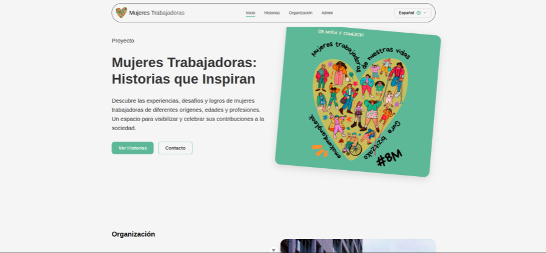
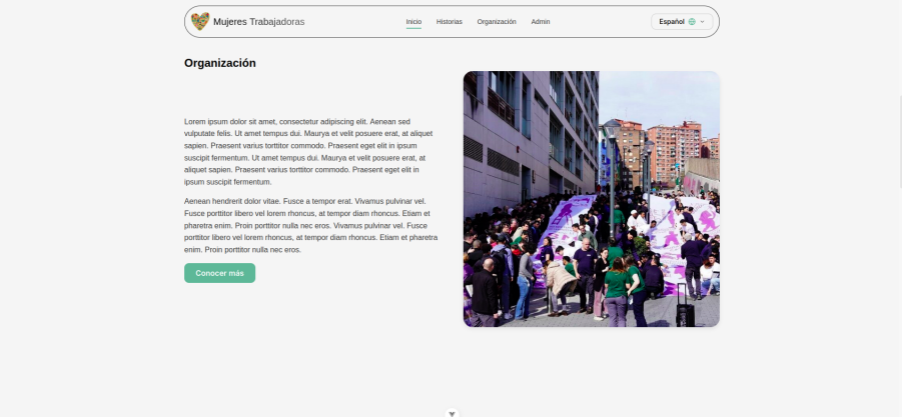
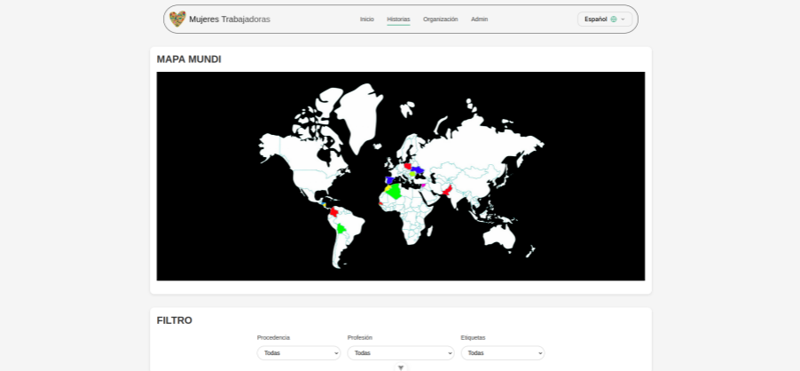
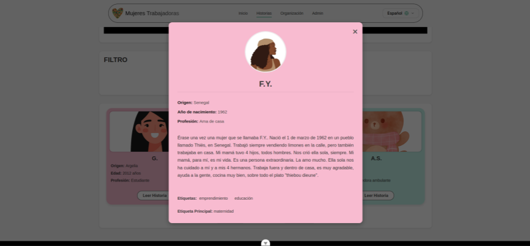
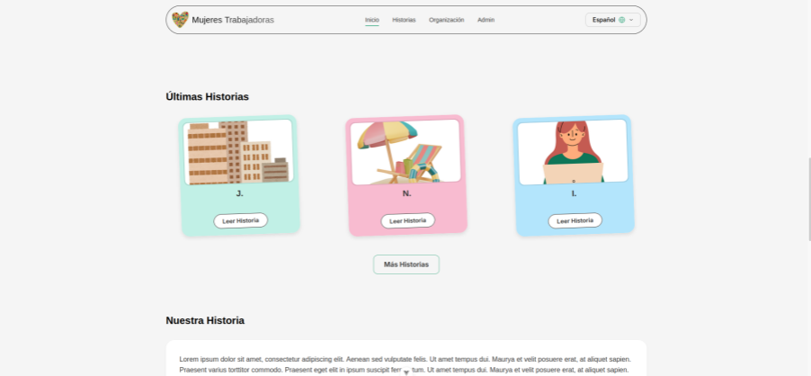
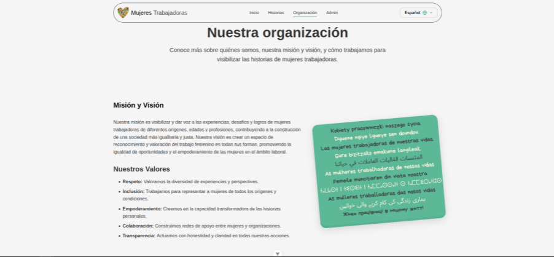
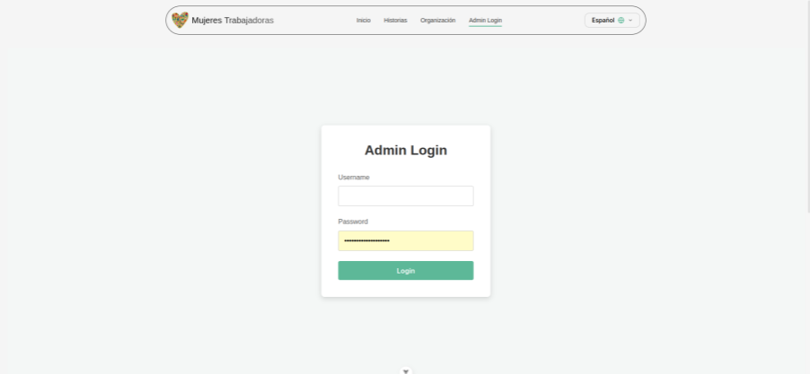
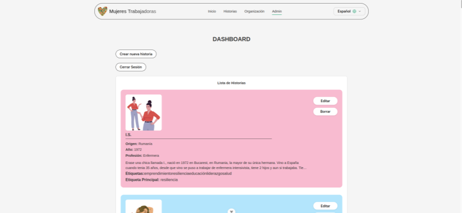
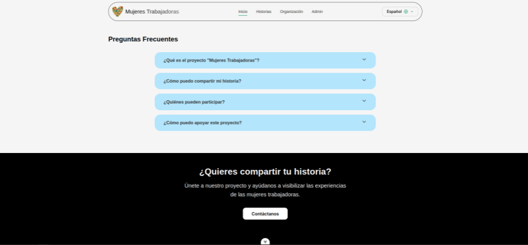

# Working Women - Frontend Project

This is the frontend application for the "Working Women" (Mujeres Trabajadoras) project, built with Vue 3 and Vite. It serves as an interface to display and manage inspiring stories of working women from around the world, connecting to a backend API for data.

## Project Overview

The "Working Women" project aims to provide a platform to discover the experiences, challenges, and achievements of working women from diverse backgrounds, ages, and professions. This frontend application allows users to:

* Browse and read stories.
* Filter stories based on various criteria.
* View information about the organization.
* Administrators can log in to manage stories and users.

## Features

* **Vue 3:** Built with the latest version of the progressive JavaScript framework.
* **Vite:** Fast development and build tooling.
* **Vue Router:** Handles client-side routing, including protected admin routes.
* **Pinia:** State management for authentication, stories, and language settings.
* **Vue-i18n:** Internationalization support with multiple languages (Spanish, English, French, Arabic, Urdu).
* **Authentication:** JWT-based login/logout system for administrators.
* **API Integration:** Communicates with a backend API (expected at `http://127.0.0.1:5000/api` by default) for data handling.
* **Story Management:** Public view with filtering and an admin section for CRUD operations.
* **Testing:** Unit tests set up with Vitest and Vue Test Utils.
* **Linting:** Code quality enforced with ESLint and Vue-specific rules.
* **Styling:** Uses a structured CSS approach with `normalize.css`, `base.css`, and `main.css`.

## Recommended IDE Setup

* [VSCode](https://code.visualstudio.com/)
* [Volar](https://marketplace.visualstudio.com/items?itemName=Vue.volar) (ensure Vetur is disabled)
* [ESLint](https://marketplace.visualstudio.com/items?itemName=dbaeumer.vscode-eslint)
* [EditorConfig for VS Code](https://marketplace.visualstudio.com/items?itemName=EditorConfig.EditorConfig)

## Project Setup

### Prerequisites

* Node.js (Version >= 18 recommended, check `package.json` engines if specified)
* npm (or your preferred package manager like yarn or pnpm)
* A running instance of the backend API (see [Environment Variables](#environment-variables)).

### Installation

1.  Clone the repository:
    ```sh
    git clone <repository-url>
    cd front-conexion-back 
    ```
2.  Install dependencies:
    ```sh
    npm install
    ```

### Environment Variables

The application connects to a backend API. The base URL for this API can be configured via an environment variable.

1.  Create a `.env.local` file in the project root (`proyectopedagogico/front/front-conexion-back/`).
2.  Add the following line, adjusting the URL if your backend runs elsewhere:
    ```env
    VITE_API_BASE_URL=[http://127.0.0.1:5000/api](http://127.0.0.1:5000/api)
    ```
    If this file or variable is not present, it will default to `http://127.0.0.1:5000/api`.

## Available Scripts

* **`npm run dev`**: Starts the development server with Hot-Module Replacement (HMR).
* **`npm run build`**: Compiles and minifies the application for production.
* **`npm run preview`**: Serves the production build locally to preview it.
* **`npm run test:unit`**: Runs unit tests using Vitest.
* **`npm run lint`**: Lints and automatically fixes code style issues using ESLint.

## Project Structure


```
├── .vscode/         # VS Code settings and recommendations
├── public/          # Static assets (like favicon)
├── src/
│   ├── assets/      # CSS, fonts, images, and static JSON (like countries)
│   ├── components/  # Reusable Vue components (and their tests)
│   ├── i18n/        # Internationalization setup
│   ├── locales/     # Language files (es, en, fr, ar, ur)
│   ├── router/      # Vue Router configuration
│   ├── services/    # API communication (api, auth, story services)
│   ├── stores/      # Pinia state management stores
│   ├── views/       # Page-level Vue components
│   ├── App.vue      # Root Vue component
│   └── main.js      # Application entry point
├── .eslintrc.js     # ESLint configuration
├── index.html       # Main HTML entry point
├── package.json     # Project dependencies and scripts
├── package-lock.json # Locked versions of dependencies
├── README.md        # This file
└── vite.config.js   # Vite configuration
└── vitest.config.js # Vitest configuration
```

## Customize Configuration

See [Vite Configuration Reference](https://vite.dev/config/).

## Contributing

Pull requests are welcome. For major changes, please open an issue first to discuss what you would like to change.

Please make sure to update tests as appropriate.

## License

(Specify your project's license here, or indicate if it's private as suggested by `package.json`'s `"private": true` field).


## Customize configuration

See [Vite Configuration Reference](https://vite.dev/config/).

## Project Setup

```sh
npm install
```

### Compile and Hot-Reload for Development

```sh
npm run dev
```

### Compile and Minify for Production

```sh
npm run build
```

### Run Unit Tests with [Vitest](https://vitest.dev/)

```sh
npm run test:unit
```

### Lint with [ESLint](https://eslint.org/)

```sh
npm run lint
```

## Screenshots









